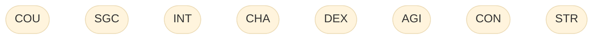
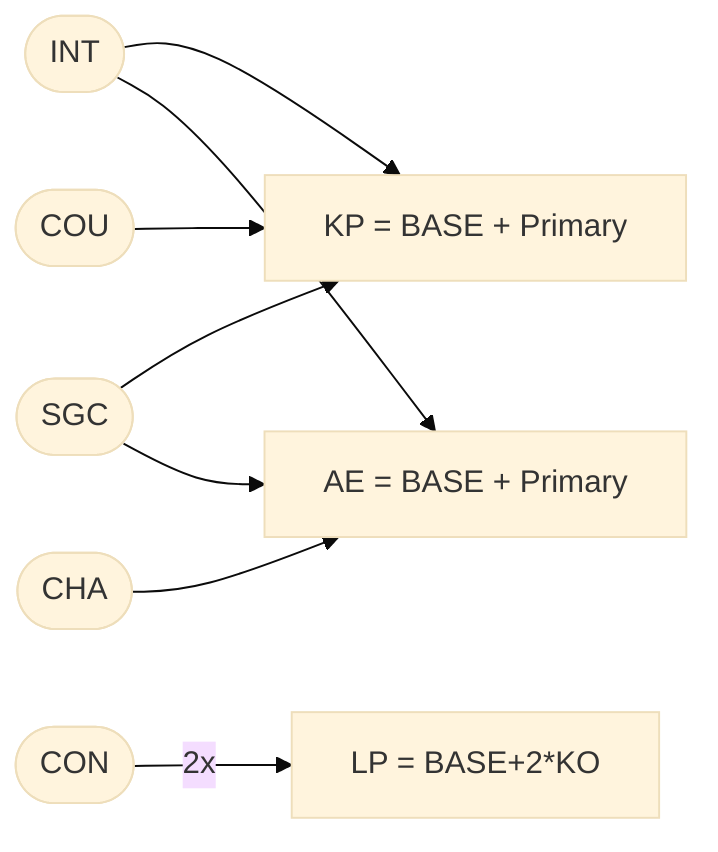
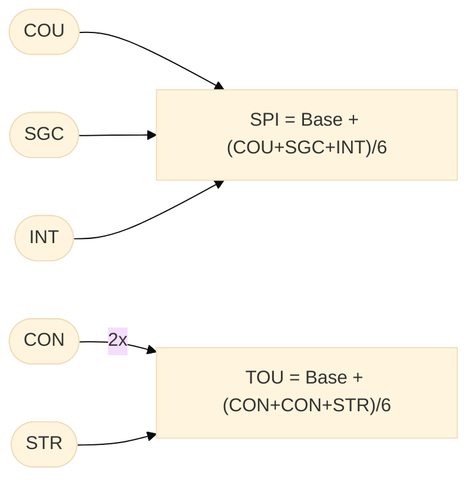
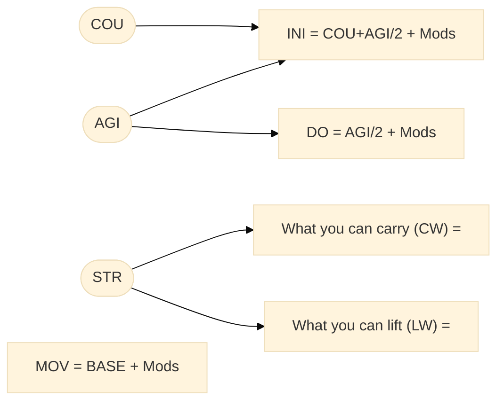
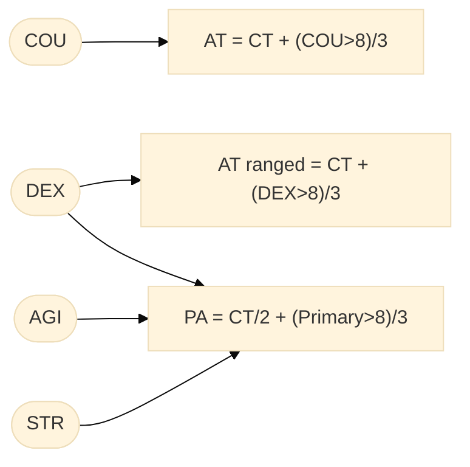

The purpose of this document: reflect the rules of DSA5 and derive the requirements.

# Attributes

## Wording

Any character value is called an **attribute**.

Courage, strength, ... are called abilities (while VR1 says 'attributes').

Skills are basic, mundane skills (like perception, ...). But arcane and karma skills are called skills as much as the combat techniques. Only that the program logic handles combat techniques differently.

The combat technique describes the basic skill with a certain weapon's branch. Each particular weapon may modify the attack and parry skill, as well as the hit points.


**Overview**: 

* Attributes
  * Abilities: COU, SGC, ...
  * Energies<sup>1</sup>: LP, AE, KP
  * Resilience<sup>1</sup>: SPI, TOU
  * Skills
    * basic/mundane: ...
    * Arcane: ...
    * Karma: ...
    * Combat technique
  * Physicals<sup>1</sup>:
    * INI²
    * DO² (Dodge)
    * MOV²
    * CW<sup>*</sup> (Carrying weight)
    * LW<sup>*</sup> (Lifting weight)

<sup>*</sup> attribute specific to Fate Explorer
<sup>1</sup> derived from ability


## Kinds of Values

* **Imported** value: the value as it was understood by importing a character sheet.
* **True** value: the correct character's attribute after applying special abilities, advantages and disadvantages. Fate explorer will not be able to recognize all rules so players must have the feature to set the true value themselves.
* **Effective** value. An attribute value modified either...
  * by a modification at the GMs discretion.
  * by temporary states and conditions.
  * for dependent attributes when the dependencies change.


# Rolls & Checks

## Types of Checks (Rule Book)

### Simple Checks

The simple check is a regular skill check. The outcome of this check depends on whether the hero succeeds at the check. If the hero succeeds the result will be classified.


### Competitive Checks

The competitive check allows you to compare two contestants, and the one with the higher QL wins the check.

FE supports competitive checks only in the bazaar when haggling over merchandise (10-06-2022).


### Cumulative Check

Sometimes it takes a certain amount of time and more than one skill check to accomplish a task. In such cases, the GM calls for a cumulative check. This consists of multiple skill checks of the same kind, wherein the hero must accumulate a total of 10 QL in order to accomplish the task at hand.

Not supported (10-06-2022)

### Group Checks

A group of heroes must work together to achieve certain goals. When several heroes use skills to work together, the procedure is called a group check. Group checks can be competitive or cumulative checks, but never simple checks. In group checks, add up the combined results of all participating characters.

Not supported (10-06-2022)


## Add Combat Checks

All attack checks are handled by the same class with only the exception of shields. The class distinguishes botch rolls that are different for unarmed combat, shields or ranged combat. It also distinguishes 

To add a combat check you need a new entry in "rollresolver.json". Example:

``` json
"CT_3/AT":  {"id": "CT_3/AT",  "roll": "DSA5/0/combat/attack", "name": "Attack", "type": "compare"}
```

* The key of the entry starts the combat technique. The "AT" or "PA" identifier dinstinguishes attack and parry actions. 
* The `roll` attribute denotes the `checkTypeId` of the roll check class (derived from `CheckBaseM`).
* `name`is an arbitrary string to describe the action in a human readable form (unsused so far).
* `type` (unused)


# FateExplorer

The FE distinguishes rolls and checks. A roll is whatever you can do with rolling one dice cup. A check requires several rolls and may involve additional criteria, tables and comparisons.


## Checks: Overview

| Type | Roll | Criterion | Result |
| --- | --- | --- | --- |
| Botch (effects) roll  | 2d6 | botch table | Enum |
| Skill roll  | 3d20 | (abilities - mods) + skill => Quality level | `RollSuccessLevel` |
| Routine skill "roll" |  |  | `RollSuccessLevel` + Quality level |
| Attack Roll | 1d20 | attack skill - mod |`RollSuccessLevel`|
| Parry Roll | 1d20 | attack skill - mod (mod halves skill for critical) | `RollSuccessLevel` |
| Critical confirmation roll | 1d20 | attack skill - mod | `RollSuccessLevel` |
| Ability roll | 1d20 | ability + mod | `RollSuccessLevel` |
| Damage roll  | NdM + x | - (m is usually 6) | points |
| Initiative roll | INI + 1d6 + mod | - | points |
| Regeneration roll | 1d6 + mod | - | points |
| Meditation roll |  |  |  |


## Roll Sequences

1. Single roll
2. 1d20 --> &empty; | Damage | Confirmation --> Damage | Botch roll --> [Damage] | Effect


## Combat

---
<details>
<summary markdown="span">NOTES: Terms and Legend</summary>

* The right hand in this context is the dominant hand (while left is non-dominant). 
* The dominant hand is called **main** hand.
* The non-dominant is the **off** hand.
* AT and PA in this table are regular AT/PA values when calculated for the main (dominant) hand.
</details>

---


* General **off-hand penalty** is -4.
  * The penalty is removed by advantage *Ambidextrous*.
  * QUESTION: does the off-hand penalty apply in unarmed combat actions? Assumption is: Yes.
* General **two-weapon penalty** is -2; 
  * but it is only used for a second weapon or parry weapon, but not shields.
  * penalty is reduced with special ability *Two-Weapon Combat I-II*.
  * QUESTION: does the off-hand penalty apply in unarmed combat actions? Assumption is: No.
* The **parry bonus** for shields is the parry modifier that is specified for each single item that can be used as a weapon.
* When defending with a shield, it's important to decide whether you want to use the shield passively (adding its Parry to the base Parry stat of your main weapon), or actively, with the combat technique 'Shields', to receive double the shield's Parry bonus.
* The only documented parry weapon (that is technically a weapon) seems to be the **main-gauche** (parrying dagger).
* Other parry weapons are technically shields (most of all bucklers). Their 'PA-bonus' is 0 but an addtional PA-bonus is documented in the comments. This bonus of +1 will be called *PW1*.


| Situation                 | Right hand   | Left hand    | R Modified                  | L Modified           | Questions & Exceptions  |
|---------------------------|--------------|--------------|-----------------------------|----------------------|------------|
| Unarmed                   | &#8709;      | &#8709;      | *Regular brawling*          | AT -4 / PA -4        | -4 penalty is removed by advantage *Ambidextrous* |
| Dominant                  | Weapon       | &#8709;      | no mods                     | AT -4 / PA -4        | -4 penalty is removed by advantage *Ambidextrous* |
| Non-Dominant              | &#8709;      | Weapon       | *Regular brawling*          | AT -4 / PA -4        | -4 penalty is removed by advantage *Ambidextrous* |
| Two-weapon                | Weapon       | Weapon       | AT -2 / PA -2               | AT -2 -4 / PA -2 -4  | -2 applies per combat round<br>-2 penalty is reduced with special ability *Two-Weapon Combat I-II*<br>-4 penalty is removed by advantage *Ambidextrous* |
| Dominant                  | &#8709;      | Shield       | AT &pm;0 / PA +PA-bonus     | AT -4 / PA &pm;0     | -4 penalty is removed by advantage *Ambidextrous*<br>Shields do not suffer the off-hand penalty for parades |
| Non-Dominant              | Shield       | &#8709;      | no mods                     | *Regular brawling*   |            |
| Both                      | Weapon       | Shield       | AT &pm;0 / PA +PA-bonus     | AT -4 / PA +PA-bonus | -4 penalty is removed by advantage *Ambidextrous*<br>Shields do not suffer the off-hand penalty for parades<br>PA nonus is the PA mod specific to the shield. |
| Two-weapon, shield attack | Weapon       | Shield       | AT -2                       | AT -2                | When shields is used to attack<br>-2 penalty is reduced with special ability Two-Weapon Combat I-II   |
| Dominant                  | &#8709;      | Parry weapon | Brawl AT &pm;0 / PA +*PW1*  | AT -4 / PA...        |            |
| Non-Dominant              | Parry weapon | &#8709;      | no mods                     |                      |            |
| Two-weapon                | Weapon       | Parry weapon | AT &pm;0 / PA +*PW1*        |                      | Decide each combat round whether to use the passive parry bonus<br>or the active parade with parry weapon |
| Two-handed                <td colspan=2> Weapon         <td colspan=2> no mods                               |            |
| Two-weapon both shields   | Shield       | Shield       | AT -2 / PA -2 +max(PA-bonus)|                      |            |
| Two-parry-weapon          | Parry weapon | Parry weapon | AT -2 / PA -2 +*PW1*        |                      |            |


# Character Attributes

One can roll checks against these:

**Abilities**

| Name | Abbr. | Original |
| ---- | ----- | -------- |
| Courage   | COU | Mut |
| Sagacity  | SGC | Klugheit |
| Intuition | INT | Intuition |
| Charisma  | CHA | Charisma |
| Dexterity | DEX | Fingerfertigkeit |
| Agility   | AGI | Gewandtheit |
| Constitution | CON | Konstitution |
| Strength     | STR | Körperkraft |


**Energies**.

* Health/Life Points
* Arcane Energy
* Karma Points


**Resiliencies**. The `resilience` attributes act as modifiers

* Spirit (SPI; Seelenkraft, SK)
* Toughness (TOU; Zähigkeit, ZK)

**Physicals**. 

* Initiative (INI).
* **Dodge** (DO; Ausweichen, AW)
* **Movement** (MOV; Geschwindigkeit, GW)

**Fate Points**.

## Attribute Dependencies


<!-- 

-->

First of all, the the rules specify certain dependencies. During game play can be temporarily impaired. Reasons may be an:

* Conditions, e.g.
  * Encumbrance affects AT, PA, DO, MOV, and INI (certain skill checks, too)
  * Pain affects MOV (and all checks, too)
  * Paralysis affects MOV (3/4th, 1/2, 1/4th)
* States, e.g.
  * Bound sets MOV = 0 and DO -4
  * Incapacitated sets MOV = 0
  * Prone sets: MOV = 1, AT -4, PA -2, DO -2
* Master's decision: The hero entered an intimidating situation. After a failed check on COU the COU value is decreased by 1 until the hero leaves the environment.
* Artefacts (blessed or magic)

In short, it must be possible for a player to temporarily modify any of these attributes.

### Energies



### Resiliencies




### Bodily Feats



### Combat


